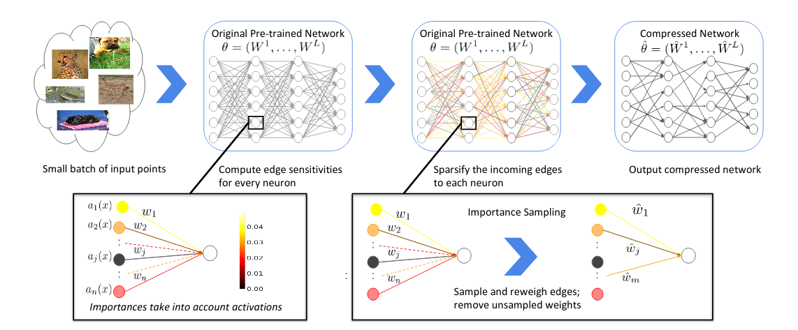
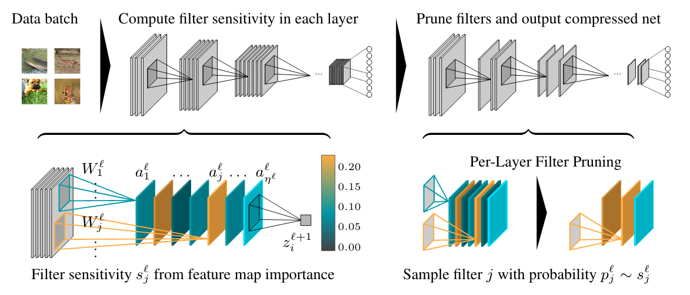
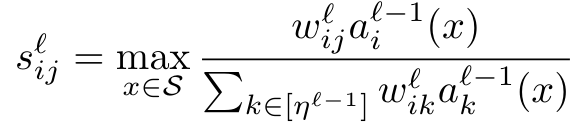
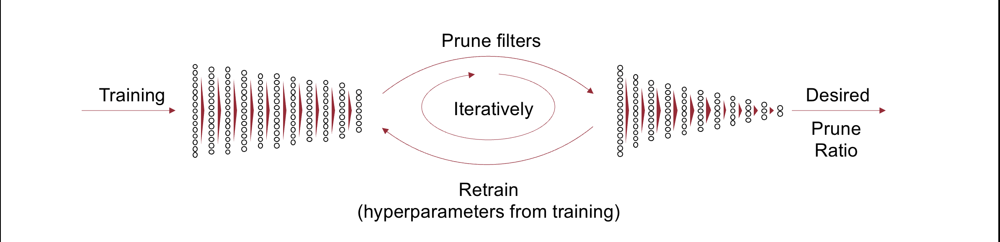

# Provable Pruning of Neural Networks using Sensitivity
[Lucas Liebenwein*](http://www.mit.edu/~lucasl/), 
[Cenk Baykal*](http://www.mit.edu/~baykal/), 
[Igor Gilitschenski](https://www.gilitschenski.org/igor/), 
[Harry Lang](https://www.csail.mit.edu/person/harry-lang), 
[Dan Feldman](http://people.csail.mit.edu/dannyf/),
[Daniela Rus](http://danielarus.csail.mit.edu/)

Implementation of provable pruning using sensitivity as introduced in  [SiPPing
Neural Networks: Sensitivity-informed Provable Pruning of Neural Networks](https://arxiv.org/abs/1910.05422)
(weight pruning) and [Provable Filter Pruning for Efficient Neural
Networks](https://arxiv.org/abs/1911.07412) (filter pruning). These algorithms
rely on a notion of sensitivity (the product of the data and the weight) to
provably quantify the error introduced by pruning. This repo contains a
stand-alone package (`./src/provable_pruning`) that can be used to prune your 
custom neural network in PyTorch as well as an experiment package
(`./src/experiment`) to fully reproduce the experiments from our paper.

***Equal contribution**

## Methods

### [SiPPing Neural Networks](https://arxiv.org/abs/1910.05422) (Weight Pruning)
<p align="center">
  
</p>

### [Provable Filter Pruning](https://arxiv.org/abs/1911.07412) (Filter Pruning)
<p align="center">
  
</p>

### Sensitivity of a weight
These algorithm rely on a novel notion of weight sensitivity as saliency score
for weight parameters in the network to estimate their relative importance. 
In the simple case of a linear layer the sensitivity of a single weight `w_ij` 
in layer `l` can be defined as the maximum relative contribution of the weight
to the corresponding output neuron over a small set of points `x \in S`:

<p align="center">
  
</p>

The weight hereby represents the edge connecting neuron `j` in layer `ell-1` to
neuron `i` in layer `l`. This notion can  then be generalized to convolutional
layers, neurons, and filters among others as is shown in the respective papers. 

In the papers, we show how pruning according to (empirical) sensitivity
enables us to provably quantify the trade-off between the error and sparsity of
the resulting pruned neural network.

### Pruning in practice
In practice, the prune pipeline follows an iterative procedure between
pruning and retraining.
<p align="center">
  
</p>

## Setup
We recommend installing the packages in a separate [conda
environment](https://docs.conda.io/projects/conda/en/latest/user-guide/getting-started.html#managing-python).
To create a new conda environment run
```sh
conda create -n pp
conda activate pp
```
To install the `provable_pruning` package containing the pytorch implementation
of our pruning methods as well as all comparison methods, run
```sh
pip install -e ./src/provable_pruning
```
**Note** that if you simply want to use our compression method in your own
code/experiments it is sufficient to install the above package.

To install the `experiment` package containing the code required to reproduce
our experiments, run
```sh
pip install -e ./src/experiment
```

## Run experiments
You can find all experiment configurations as outlined in the paper under 
`src/experiment/experiment/param`. You can run any of the configurations by
providing the relative path from `param`. For example, to run `Resnet20` on
`CIFAR10` run
```sh
python -m experiment.main cifar/resnet20.yaml
```

### ImageNet experiments 
To reproduce the ImageNet experiments, you first need to download the dataset
from [here](http://image-net.org/download). Place the file into
`./data/training/imagenet_object_localization.tar.gz`. The rest is handled
automatically.

To download the pre-trained ImageNet networks (and reduce training time), run
```sh
python -m experiment.util.download_imagenet_weights
```

### Logging
Experiment progress is logged using tensorboard. To see the current progress,
simply start tensorboard from the log directory
```sh
tensorboard --logdir=./data/results
```
and follow the instructions to visualize the data.

### Results
At the end of the run, plots (`.pdf`) and the raw numpy data (`.npz`) are 
stored under `./data/results`.

## Citations
Please cite the following papers for weight and filter pruning, respectively,
when using our work.

### [SiPPing Neural Networks](https://arxiv.org/abs/1910.05422) (Weight Pruning)
```
@article{baykal2019sipping,
  title={SiPPing Neural Networks: Sensitivity-informed Provable Pruning of Neural Networks},
  author={Baykal, Cenk and Liebenwein, Lucas and Gilitschenski, Igor and Feldman, Dan and Rus, Daniela},
  journal={arXiv preprint arXiv:1910.05422},
  year={2019}
}
```
### [Provable Filter Pruning](https://arxiv.org/abs/1911.07412) (Filter Pruning)
```
@inproceedings{
liebenwein2020provable,
title={Provable Filter Pruning for Efficient Neural Networks},
author={Lucas Liebenwein and Cenk Baykal and Harry Lang and Dan Feldman and Daniela Rus},
booktitle={International Conference on Learning Representations},
year={2020},
url={https://openreview.net/forum?id=BJxkOlSYDH}
}
```

## blg convenience script
### Setup
cd into the top-level compression directory, i.e., 
```
cd /path/to/compression
```
Now run
```
chmod +x misc/blg.py
python3 misc/blg.py setup
source ~/.bashrc
```
### Functionality
From now on, you can use `blg` to access the convenience scripts. `blg -h
` will give you the available commands at the different levels. For more
questions ask [Lucas](mailto:lucasl@mit.edu).