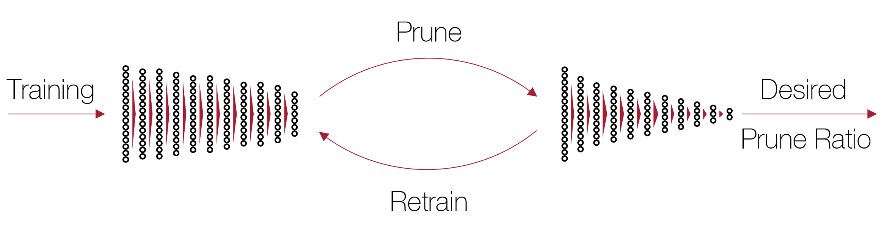

# Neural Network Pruning
[Lucas Liebenwein](https://people.csail.mit.edu/lucasl/), 
[Cenk Baykal](http://www.mit.edu/~baykal/),
[Alaa Maalouf](https://www.linkedin.com/in/alaa-maalouf/),
[Igor Gilitschenski](https://www.gilitschenski.org/igor/), 
[Dan Feldman](http://people.csail.mit.edu/dannyf/),
[Daniela Rus](http://danielarus.csail.mit.edu/)

<p align="center">
  
</p>

### Papers
This repository contains code to reproduce the results from the following
papers: 
| Paper | Venue | Title & Link | 
| :---: | :---: | :---         |
| **ALDS** | NeurIPS 2021 | [Compressing Neural Networks: Towards Determining the Optimal Layer-wise Decomposition](https://arxiv.org/abs/2107.11442) |
| **Lost** | MLSys 2021 | [Lost in Pruning: The Effects of Pruning Neural Networks beyond Test Accuracy](https://proceedings.mlsys.org/paper/2021/hash/2a79ea27c279e471f4d180b08d62b00a-Abstract.html) |
| **PFP** | ICLR 2020 | [Provable Filter Pruning for Efficient Neural Networks](https://openreview.net/forum?id=BJxkOlSYDH) |
| **SiPP** | arXiv | [SiPPing Neural Networks: Sensitivity-informed Provable Pruning of Neural Networks](https://arxiv.org/abs/1910.05422) |

### Packages
In addition, the repo also contains two stand-alone python packages that 
can be used for any desired pruning experiment: 
| Packages | Location | Description |
| :---:    | :---:    | :---        |
|`torchprune` | [./src/torchprune](./src/torchprune) | This package can be used to run any of the implemented pruning algorithms. It also contains utilities to use pre-defined networks (or use your own network) and utilities for standard datasets. |
| `experiment` | [./src/experiment](./src/experiment) | This package can be used to run pruning experiments and compare multiple pruning methods for different prune ratios. Each experiment is configured using a `.yaml`-configuration files. |

### Paper Reproducibility
The code for each paper is implemented in the respective packages. In addition,
for each paper we have a separate folder that contains additional information
about the paper and scripts and parameter configuration to reproduce the exact
results from the paper.
| Paper | Location |
| :---: | :---:    |
| **ALDS** | [paper/alds](./paper/alds) |
| **Lost** | [paper/lost](./paper/lost) |
| **PFP**  | [paper/pfp](./paper/pfp)   |
| **SiPP** | [paper/sipp](./paper/sipp) |

## Setup
We provide three ways to install the codebase:
1. [Github repo + full conda environment](#1-github-repo)
2. [Installation via pip](#2-pip-installation)
3. [Docker image](#3-docker-image)

### 1. Github Repo
Clone the github repo:
```bash
git pull git@github.com:lucaslie/torchprune.git
# (or your favorite way to pull a repo)
```

We recommend installing the packages in a separate [conda
environment](https://docs.conda.io/projects/conda/en/latest/user-guide/getting-started.html#managing-python).
Then to create a new conda environment run
```bash
conda create -n prune python=3.8 pip
conda activate prune
```
To install all required dependencies and both packages, run: 
```bash
pip install -r misc/requirements.txt
```
Note that this will also install pre-commit hooks for clean commits :-)
### 2. Pip Installation
To separately install each package with minimal dependencies without 
cloning the repo manually, run the following commands: 
```bash
# "torchprune" package
pip install git+https://github.com/lucaslie/torchprune/#subdirectory=src/torchprune

# "experiment" package
pip install git+https://github.com/lucaslie/torchprune/#subdirectory=src/experiment
```
Note that the [experiment](./src/experiment) package does not automatically 
install the [torchprune](./src/torchprune) package.
### 3. Docker Image
You can simply pull the docker image from our docker hub: 
```bash
docker pull liebenwein/torchprune
```

You can run it interactively with
```bash
docker run -it liebenwein/torchprune bash
```

For your reference you can find the Dockerfile [here](./misc/Dockerfile).

## More Information and Usage
Check out the following `README`s in the sub-directories to find out more about
using the codebase.

| READMEs | More Information
| --- | --- |
| [src/torchprune/README.md](./src/torchprune) | more details to prune neural networks, how to use and setup the data sets, how to implement custom pruning methods, and how to add your data sets and networks. |   
| [src/experiment/README.md](./src/experiment) | more details on how to configure and run your own experiments, and more information on how to re-produce the results. |
| [paper/alds/README.md](./paper/alds) | check out for more information on the [ALDS](https://arxiv.org/abs/2107.11442) paper. |
| [paper/lost/README.md](./paper/lost) | check out for more information on the [Lost](https://proceedings.mlsys.org/paper/2021/hash/2a79ea27c279e471f4d180b08d62b00a-Abstract.html) paper. |
| [paper/pfp/README.md](./paper/pfp) | check out for more information on the [PFP](https://openreview.net/forum?id=BJxkOlSYDH) paper. |
| [paper/sipp/README.md](./paper/sipp) | check out for more information on the  [SiPP](https://arxiv.org/abs/1910.05422) paper. |

## Citations
Please cite the respective papers when using our work.

### [Towards Determining the Optimal Layer-wise Decomposition](https://arxiv.org/abs/2107.11442)
```
@inproceedings{liebenwein2021alds,
 author = {Lucas Liebenwein and Alaa Maalouf and Dan Feldman and Daniela Rus},
 booktitle = {Advances in Neural Information Processing Systems},
 title = {Compressing Neural Networks: Towards Determining the Optimal Layer-wise Decomposition},
 url = {https://arxiv.org/abs/2107.11442},
 volume = {34},
 year = {2021}
}
```

### [Lost In Pruning](https://proceedings.mlsys.org/paper/2021/hash/2a79ea27c279e471f4d180b08d62b00a-Abstract.html)
```
@article{liebenwein2021lost,
title={Lost in Pruning: The Effects of Pruning Neural Networks beyond Test Accuracy},
author={Liebenwein, Lucas and Baykal, Cenk and Carter, Brandon and Gifford, David and Rus, Daniela},
journal={Proceedings of Machine Learning and Systems},
volume={3},
year={2021}
}
```

### [Provable Filter Pruning](https://openreview.net/forum?id=BJxkOlSYDH)
```
@inproceedings{liebenwein2020provable,
title={Provable Filter Pruning for Efficient Neural Networks},
author={Lucas Liebenwein and Cenk Baykal and Harry Lang and Dan Feldman and Daniela Rus},
booktitle={International Conference on Learning Representations},
year={2020},
url={https://openreview.net/forum?id=BJxkOlSYDH}
}
```

### [SiPPing Neural Networks](https://arxiv.org/abs/1910.05422)
```
@article{baykal2019sipping,
title={SiPPing Neural Networks: Sensitivity-informed Provable Pruning of Neural Networks},
author={Baykal, Cenk and Liebenwein, Lucas and Gilitschenski, Igor and Feldman, Dan and Rus, Daniela},
journal={arXiv preprint arXiv:1910.05422},
year={2019}
}
```