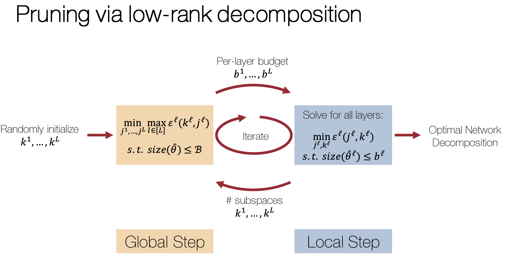

# Compressing Neural Networks: Towards Determining the Optimal Layer-wise Decomposition
[Lucas Liebenwein*](https://people.csail.mit.edu/lucasl/), 
[Alaa Maalouf*](https://www.linkedin.com/in/alaa-maalouf/),
[Dan Feldman](http://people.csail.mit.edu/dannyf/),
[Daniela Rus](http://danielarus.csail.mit.edu/)

***Equal contribution**

<p align="center">
  
</p>
<!-- <br clear="left"/> -->

We present a global compression framework for deep neural networks that
automatically analyzes each layer to identify the optimal per-layer compression
ratio, while simultaneously achieving the desired overall compression. Our
algorithm hinges on the idea of compressing each convolutional (or
fully-connected) layer by slicing its channels into multiple groups and
decomposing each group via low-rank decomposition. 

We frame the compression problem as an optimization problem where we wish to
minimize the maximum compression error across layers and propose an efficient
algorithm towards a solution.

Compared to manual solution (i.e. manual compression of each layer) our
algorithm (_Automatic Layer-wise Decomposition Selector_ or `ALDS`) automatically
determines the decomposition for each layer enabling higher compression ratios
for the same level of accuracy without requiring substantial manual
hyperparameter tuning. 

## Setup
Check out the main [README.md](../../README.md) and the respective packages for
more information on the code base. 

## Overview

### Implementation of main algorithm (`ALDS`)
Our main algorithm (_Automatic Layer-wise Decomposition Selector_ or `ALDS`) is
integrated into the [`torchprune`](../../src/torchprune) package. 

The implementation can be found
[here](../../src/torchprune/torchprune/method/alds). 

### Run compression experiments
The experiment configurations are located [here](./param). To reproduce the
experiments for a specific configuration, run: 
```bash
python -m experiment.main param/cifar/prune/resnet20.yaml
```

### Visualize results

You should be able to retrieve the nominal prune-accuracy trade-offs 
from the `data/results` folder.

You can also visualize the results using the 
[`results_viewer.py`](./script/results_viewer.py) script:
```bash
python results_viewer.py
```
Run it from inside the [`script`](./script) folder. The script can
also be run interactively as Jupyter notebook.

### Load network checkpoint

If you want to use the network checkpoints in your own experiments or code,
follow the [load_networks.py](./script/load_networks.py) script. It should be
self-explanatory.

### Hyperparameter sweeps 

If you want to run a hyperparameter sweep over different amounts of retraining,
you can run 
```bash
python -m experiment.main param/cifar/retrainsweep/resnet20.yaml
```

Note that this experiment will be quite expensive to run in terms of required
compute since it will repeat the compression experiment for different amounts
of retraining and different compression methods over multiple repetitions.

To visualize the results use the
[retrain_sweep.py](./script/retrain_sweep.py) script:
```bash
python retrain_sweep.py
```
Run it from inside the [`script`](./script) folder. The script can
also be run interactively as Jupyter notebook.

## Citation
Please cite the following paper when using our work.

### Paper link
[Compressing Neural Networks: Towards Determining the Optimal Layer-wise Decomposition](https://arxiv.org/abs/2107.11442)

### Bibtex
```
@inproceedings{liebenwein2021alds,
 author = {Lucas Liebenwein and Alaa Maalouf and Dan Feldman and Daniela Rus},
 booktitle = {Advances in Neural Information Processing Systems},
 title = {Compressing Neural Networks: Towards Determining the Optimal Layer-wise Decomposition},
 url = {https://arxiv.org/abs/2107.11442},
 volume = {34},
 year = {2021}
}
```