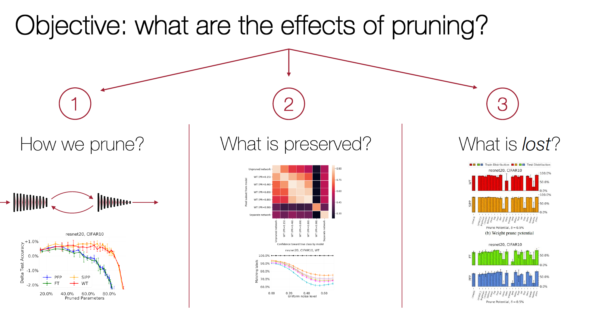
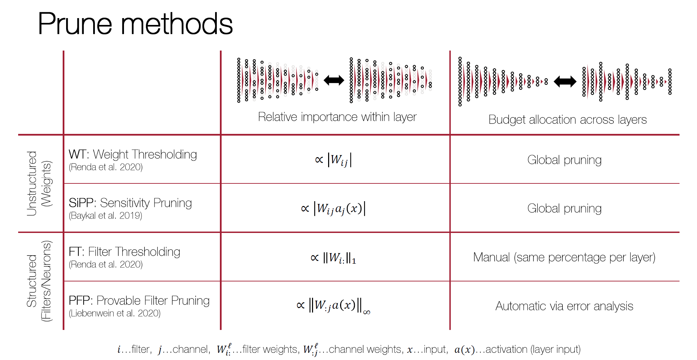
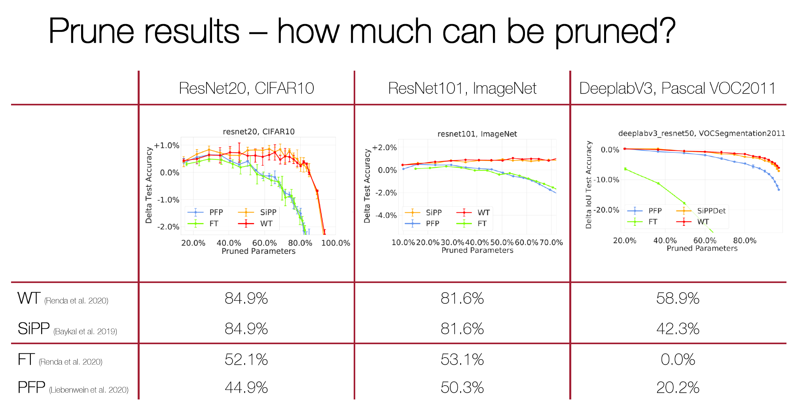
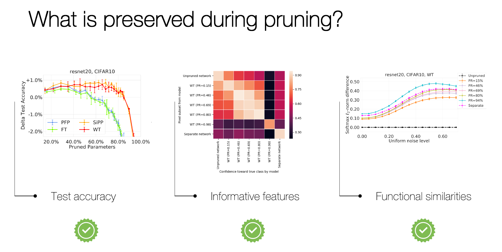
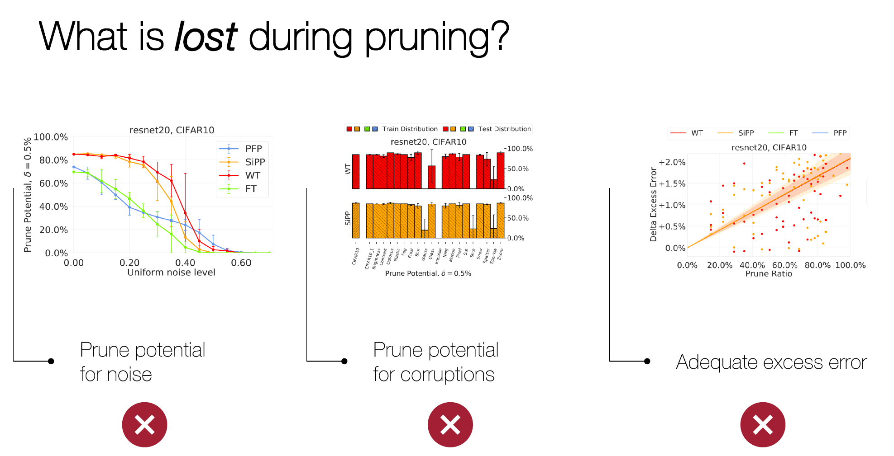

# Lost in Pruning: The Effects of Pruning Neural Networks beyond Test Accuracy
[Lucas Liebenwein](https://people.csail.mit.edu/lucasl/), 
[Cenk Baykal](http://www.mit.edu/~baykal/), 
[Brandon Carter](http://brandoncarter.me/),
[David Gifford](http://be.mit.edu/directory/david-gifford),
[Daniela Rus](http://danielarus.csail.mit.edu/)

<p align="center">
  
</p>
<!-- <br clear="left"/> -->

We study the ability of pruned neural networks to maintain the same 
predictive performance as the unpruned parent network. 

In particular, we test how the generalization ability of pruned network 
varies significantly across tasks and show that pruned networks are 
disproportionally more affected by distribution changes in the input 
compared to their unpruned counterpart. We observe this phenomenon 
although the pruned network can achieve the same performance as the
unpruned network on nominal test data. 

We formally study these observations via the prune potential among 
others, i.e., the maximal prune ratio that we can achieve without drop 
in accuracy for a given task, and we find that the prune potential 
varies significantly across tasks.

## Setup
Check out the main [README.md](../../README.md) and the respective packages for
more information on the code base. 

## Overview

### Prune Experiments
Before trying any of the other experiments, you should make sure that 
you run the pruning experiment in order to have all the prune networks
available.

#### Prune methods
<p align="center">
  
</p>

We use a variety of methods, both weight and filter pruning, to prune
the networks and test them.
<br clear="left"/>


#### Prune networks
The experiment configurations are located [here](./param). To reproduce the experiments for a specific configuration, run: 
```bash
python -m experiment.main paper/lost/param/cifar/resnet20.yaml
```

#### Prune results
<p align="center">
  
</p>

You should be able to retrieve the nominal prune-accuracy trade-offs 
from the `data/results` folder. Typical prune-accuracy trade-off curves 
can be seen on the left.

<br clear="left"/>

You can also visualize the results using the 
[`results_viewer.py`](./script/results_viewer.py) script:
```bash
python results_viewer.py
```
Run it from inside the [`script`](./script) folder. The script can
also be run interactively as Jupyter notebook.

### Similarity Experiments
<p align="center">
  
</p>

You can test the functional similarity between pruned and unpruned 
networks using the [`eps_ball.py`](./script/eps_ball.py) script. 

You can run it in a shell by providing the parameter configuration
file for which you want to test the functional similarities:
```bash
python eps_ball.py paper/lost/param/cifar/resnet20.yaml
```
Make sure to run it from inside the [`script`](./script) folder. The 
script can also be run interactively as Jupyter notebook.

Plots will be generated automatically and added to the `data/results` 
folder.


### Prune Potential Experiments
<p align="center">
  
</p>

#### Pre-process prune potential
Before evaluating the prune potential we should pre-process the 
test accuracies of all pruned networks for the various tasks.

Note that for that we can run the corresponding `hyperparameters` file 
for each of the experiment. 
For the
[`cifar/resnet20.yaml`](./param/cifar/resnet20.yaml)
experiment, the corresponding `hyperparameters` 
file is located at 
[`hyperparameters/cifar/resnet20.yaml`](./param/hyperparameters/cifar/resnet20.yaml).

Run it in a shell: 
```bash
python -m experiment.main paper/lost/param/hyperparameters/cifar/resnet20.yaml
```

#### Visualizing prune potential
You can visualize the prune potential and excess error between pruned 
and unpruned networks using the 
[`generalization.py`](./script/generalization.py) script. 

You can run it in a shell by providing the hyperparameter configuration
file for which you want to test the potential:
```bash
python generalization.py paper/lost/param/hyperparameters/cifar/resnet20.yaml
```
Make sure to run it from inside the [`script`](./script) folder. The 
script can also be run interactively as Jupyter notebook.

Plots will be generated automatically and added to the `data/results` 
folder.

## Citation
Please cite the following paper when using our work.

### Paper link
[Lost in Pruning: The Effects of Pruning Neural Networks beyond Test Accuracy](https://proceedings.mlsys.org/paper/2021/hash/2a79ea27c279e471f4d180b08d62b00a-Abstract.html)

### Bibtex
```
@article{liebenwein2021lost,
title={Lost in Pruning: The Effects of Pruning Neural Networks beyond Test Accuracy},
author={Liebenwein, Lucas and Baykal, Cenk and Carter, Brandon and Gifford, David and Rus, Daniela},
journal={Proceedings of Machine Learning and Systems},
volume={3},
year={2021}
}
```