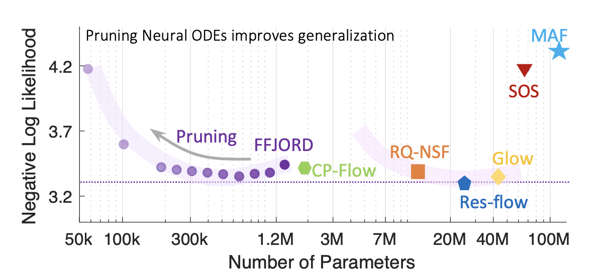

# Sparse flows: Pruning continuous-depth models
[Lucas Liebenwein*](https://people.csail.mit.edu/lucasl/), 
[Ramin Hasani*](http://www.raminhasani.com),
[Alexander Amini](https://www.mit.edu/~amini/),
[Daniela Rus](http://danielarus.csail.mit.edu/)

***Equal contribution**

<p align="center">
  
</p>
<!-- <br clear="left"/> -->

Continuous deep learning architectures enable learning of flexible 
probabilistic models for predictive modeling as neural ordinary differential 
equations (ODEs), and for generative modeling as continuous normalizing flows.
In this work, we design a framework to decipher the internal dynamics of these
continuous depth models by pruning their network architectures. Our empirical
results suggest that pruning improves generalization for neural ODEs in
generative modeling. We empirically show that the improvement is because
pruning helps avoid mode- collapse and flatten the loss surface. Moreover,
pruning finds efficient neural ODE representations with up to 98% less
parameters compared to the original network, without loss of accuracy. We hope
our results will invigorate further research into the performance-size
trade-offs of modern continuous-depth models.

## Setup
Check out the main [README.md](../../README.md) and the respective packages for
more information on the code base. 

## Overview

### Run compression experiments
The experiment configurations are located [here](./param). To reproduce the
experiments for a specific configuration, run: 
```bash
python -m experiment.main param/toy/ffjord/spirals/vanilla_l4_h64.yaml
```

The pruning experiments will be run fully automatically and store all the 
results.

### Experimental evaluations

The [script](./script) contains the evaluation and plotting scripts to 
evaluate and analyze the various experiments. Please take a look at each of 
them to understand how to load the pruning experiments and how to analyze
the pruning experiments. 

Each plot and experiment presented in the paper can be reproduced this way.

## Citation
Please cite the following paper when using our work.

### Paper link
[Sparse flows: Pruning continuous-depth models](https://proceedings.neurips.cc/paper/2021/hash/bf1b2f4b901c21a1d8645018ea9aeb05-Abstract.html)

### Bibtex
```
@article{liebenwein2021sparse,
  title={Sparse flows: Pruning continuous-depth models},
  author={Liebenwein, Lucas and Hasani, Ramin and Amini, Alexander and Rus, Daniela},
  journal={Advances in Neural Information Processing Systems},
  volume={34},
  pages={22628--22642},
  year={2021}
}
```
